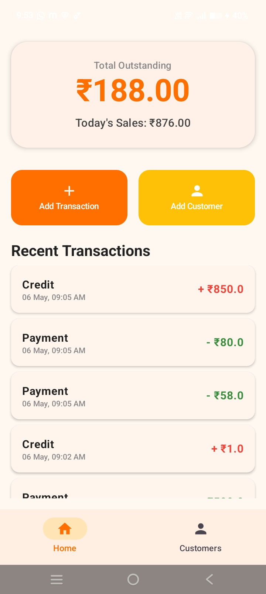
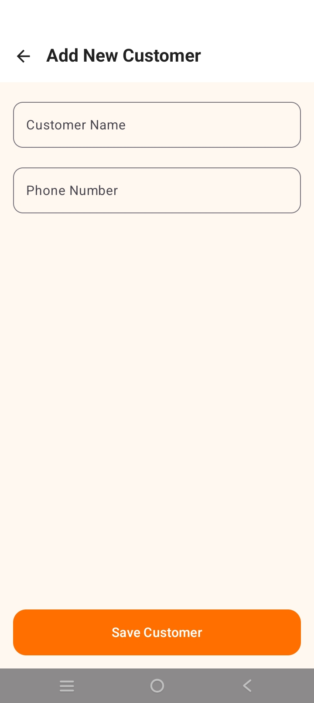

# 🧾 Namma-Santhe Ledger

  <b>Digitizing local market credit systems with simplicity and reliability</b> 
  <i>Built for real-world Santhe environments</i>

  
  

---

## 🚀 Overview

Namma-Santhe Ledger is a modern Android application designed to help small vendors manage customer credits and payments digitally.

It replaces traditional handwritten ledgers with a **simple, offline-first, and user-friendly solution**.

---

## ✨ Features

- 👤 Add and manage customers  
- 💸 Record credit (udhari) and payments  
- 📊 Automatic balance calculation  
- 📱 Send reminders via SMS / WhatsApp  
- 💾 Offline data storage (Room DB)  
- 🎨 Clean UI using Jetpack Compose  

---

## 🎬 Demo Flow

1. Add Customer  
2. Add Credit Transaction  
3. Record Payment  
4. View Balance  
5. Send Reminder  

---

## 🧠 Problem

Local vendors rely on notebooks to track transactions, leading to:

- ❌ Data loss  
- ❌ Manual calculation errors  
- ❌ Difficulty tracking dues  

---

## 💡 Solution

A lightweight Android app that:

- Digitizes transaction tracking  
- Automatically calculates balances  
- Enables instant customer communication  

---

## 🛠️ Tech Stack

- **Kotlin**
- **Jetpack Compose**
- **Room Database**
- **Android SDK**

---

## 📊 Use Case

Perfect for:

- 🛒 Local vendors  
- 🏪 Small shop owners  
- 🌾 Santhe (market) sellers  

> Works completely offline — ideal for real-world usage

---

## 🔮 Future Roadmap

- 🔊 Voice-based input (local languages)  
- 💳 UPI payment integration  
- ☁️ Cloud sync  
- 📈 Insights & analytics  

---

## 🎯 Key Highlight

> Designed for low digital literacy users with an offline-first approach.

---

## 📸 Screenshots

  
  

---

## 👩‍💻 Author

**AmulyaKR13**  
🔗 https://github.com/AmulyaKR13

---

## ⭐ Support

If you like this project, consider giving it a ⭐  
It helps others discover it!
